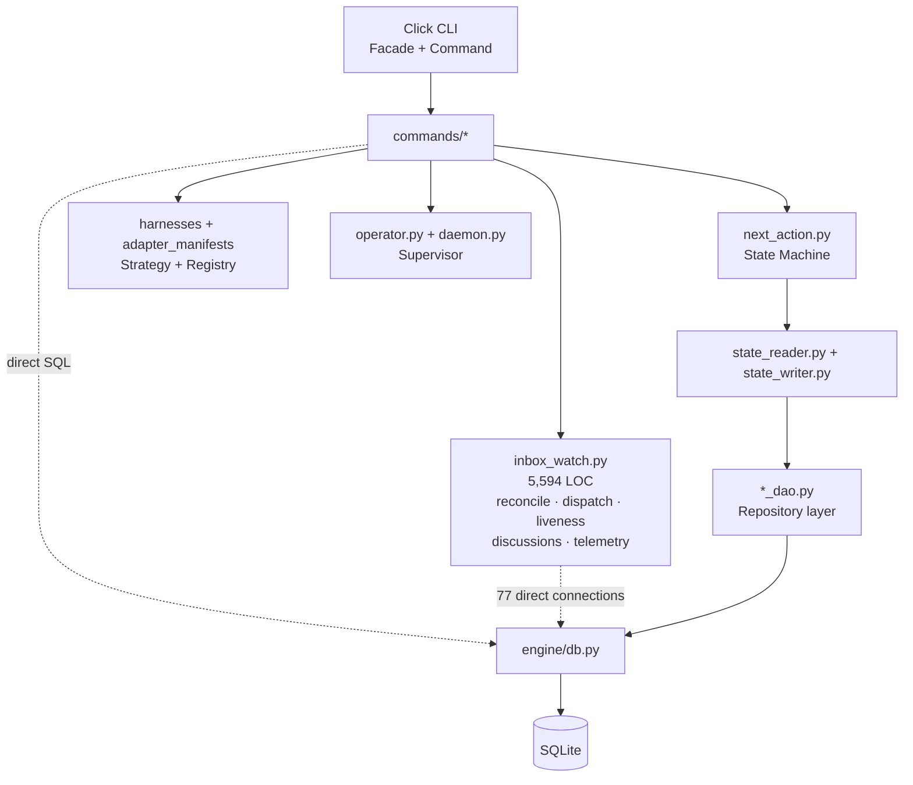
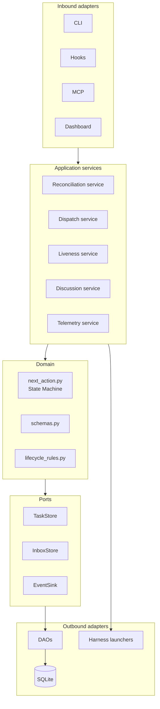

# Superharness Design Patterns

## Current architecture

## Target architecture

Keep Command, State Machine, Repository/DAO, Strategy/Registry, and Supervisor.

Start by extracting `reconcile` from `inbox_watch.py`; do not introduce a heavy clean-architecture framework.
