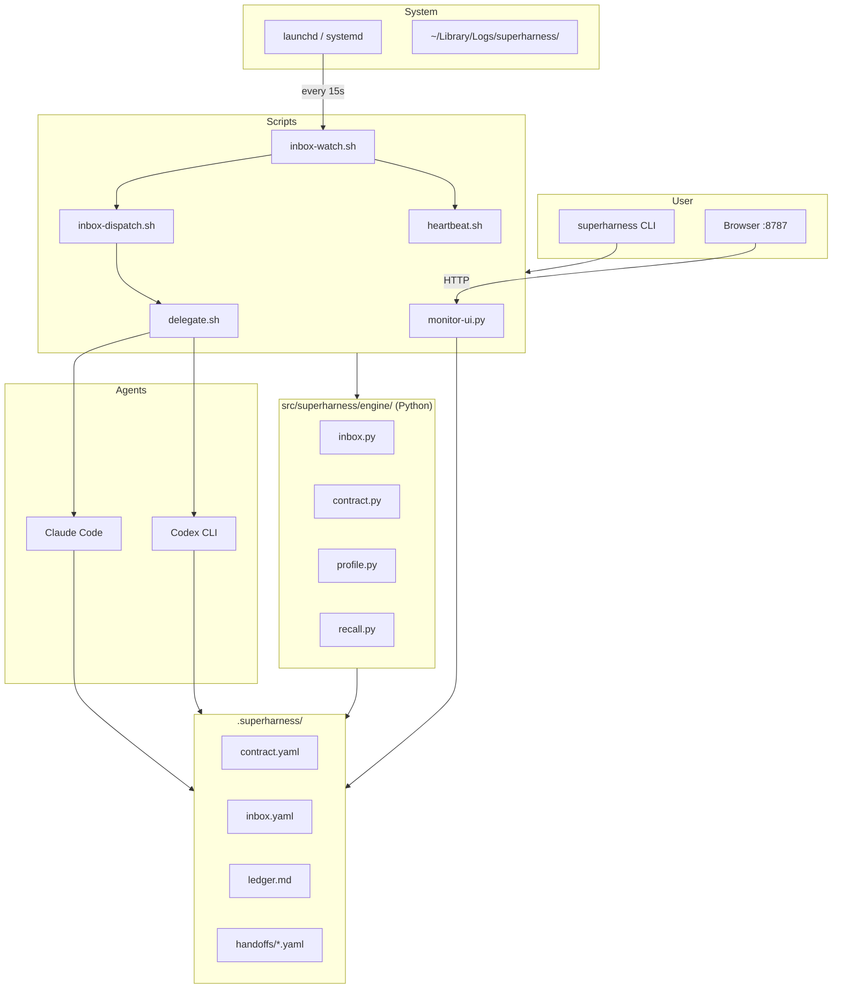

# superharness Architecture

**Why it exists, how it works, the decisions behind it.**

---

## Problem

AI coding assistants are powerful within a session but lose context when you switch agents or return days later. superharness solves:

1. **Session discontinuity** — no handoff state between sessions
2. **Agent collision** — two agents can't safely work simultaneously
3. **Task amnesia** — what was done, why, and what's next is lost
4. **Queue coordination** — no way to delegate without manual prompting
5. **Background execution** — can't run agents unattended

---

## Design Principles

| Principle | Why |
|-----------|-----|
| **Files on disk, not a server** | Works offline, git-compatible, human-readable |
| **Explicit handoffs, not shared memory** | No invisible state, no race conditions, auditable |
| **Contract-first** | Single source of truth for tasks, owners, dependencies |
| **Queue-based dispatch** | Priority support, retry logic, status tracking |
| **Append-only ledger** | Immutable history, grep-friendly, git-native |
| **Hygiene before commit** | Catch violations early, not after the fact |

---

## Layers

```
cli/                    → user-facing shell commands (delegate, enqueue, dispatch, hygiene…)
src/superharness/engine/→ Python core: YAML ops, queue transitions, contract queries, validation
scripts/                → watcher install, launchd/systemd, guard scripts, monitor-ui (with autohealth watchdog)
protocol/               → spec, templates, schema
adapters/               → Claude Code hooks, Codex CLI templates
```

**Python for `engine/`:** structured YAML support via PyYAML, fast startup. Bash handles orchestration; Python handles YAML and business logic.

---

## Runtime State (`.superharness/`)

```
contract.yaml       tasks, decisions, failures — the source of truth
handoffs/*.yaml     one file per task; written when a task completes or suspends
ledger.md           append-only event log
inbox.yaml          dispatch queue
decisions.yaml      cross-agent ADRs
failures.yaml       cross-agent failure memory
heartbeat.yaml      proactive watcher check config
profile.yaml        autonomy, primary_agent, team_size (written by install)
```

---

## Lifecycle

**Inbox item:**
```
pending → launched → running → done
        ↘ paused              ↘ failed → stale (recover.sh)
```

**Task:**
```
todo → in_progress → done
                 ↘ blocked | failed | stopped
```

`paused` = skipped this cycle (dirty worktree or plan gate pending) — retried next cycle.

---

## Architecture Diagram



---

## Key Design Decisions

**YAML not JSON** — protocol files need human-readable comments and can be edited directly. JSON is used for runtime interchange (hook output).

**Heartbeat ID allowlist** — `heartbeat.yaml` maps check `id` values to hardcoded commands in `heartbeat.sh`. The `command:` field is documentation only and never executed, preventing YAML injection.

**No database** — YAML on disk is sufficient for hundreds of handoffs and thousands of ledger lines. `superharness recall` uses grep-level search over handoffs — no embeddings needed.

---

## Agent Identity

For agents reading this: you are a coding agent working on behalf of the project owner — not a general-purpose assistant. Your job is to make forward progress on the current contract task with high precision and low blast radius.

**Operating constraints:**
- Ship > plan. One focused task per session.
- Keep changes within the current contract scope.
- Ask before touching files outside your assigned task's scope.

**Guardrails:**
- Never edit `.env`, credentials, secrets, or key files.
- Never push directly to main without human review.
- Run required checks before handoff or commit.
- If blocked, log the blocker in contract failures and stop — do not guess.

---

## See Also

- [GUIDE.md](GUIDE.md) — command reference
- [SECURITY.md](../SECURITY.md) — threat model and mitigations
- [INSTALL-AGENT.md](INSTALL-AGENT.md) — AI-driven install flow
