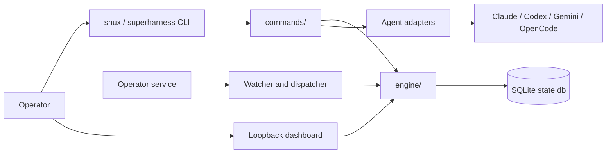

# superharness Architecture

**A local, SQLite-backed coordination layer for multi-agent coding sessions.**

superharness preserves task context, enforces lifecycle transitions, and
coordinates agent work without requiring a hosted control plane. The command-line
interface is the primary product surface; the dashboard is an optional,
loopback-only view of the same local state.

## Design principles

| Principle | Implementation |
| --- | --- |
| Local-first | Runtime state is SQLite, not a network service. The project works offline after installation. |
| One authoritative state | Tasks, inbox rows, handoffs, decisions, failures, and agent heartbeats are stored in one database. |
| Explicit state transitions | `engine/next_action.py` owns legal lifecycle transitions and recommended next actions. |
| Agent-neutral adapters | Claude Code, Codex CLI, Gemini CLI, and OpenCode integrations share manifests and a common task model. |
| Least surprise for operators | Background services are opt-in; the dashboard defaults to loopback binding and per-project authentication. |
| Compatibility without split brain | Legacy YAML can be imported or exported, but production reads use SQLite and conflicting state roots fail closed. |

## Runtime topology


```mermaid
flowchart LR
    User[Operator] --> CLI[shux / superharness CLI]
    CLI --> Commands[commands/]
    Commands --> Engine[engine/]
    Engine --> DB[(SQLite state.db)]
    Commands --> Adapters[Agent adapters]
    Adapters --> Agents[Claude / Codex / Gemini / OpenCode]
    Operator[Operator service] --> Watcher[Watcher and dispatcher]
    Watcher --> Engine
    Dashboard[Loopback dashboard] --> Engine
    User --> Dashboard
```

The CLI is a thin Click entry point in `src/superharness/cli.py`. It routes each
subcommand to `src/superharness/commands/`, where input validation and
operator-facing messages live. The engine contains the reusable state machine,
SQLite data access, lifecycle rules, and orchestration logic.

## Components

| Area | Responsibility |
| --- | --- |
| `cli.py` | Click command registration and lightweight process dispatch. |
| `commands/` | One module per command: task management, delegation, watcher control, export/import, diagnostics, and installation. |
| `engine/next_action.py` | Pure task lifecycle state machine and dispatch gates. |
| `engine/schemas.py` | Pydantic models for task, inbox, handoff, profile, and adapter data. |
| `engine/*_dao.py` | SQLite data-access layer for tasks, inbox, handoffs, decisions, failures, discussions, and heartbeats. |
| `engine/operator.py` | Starts, monitors, and stops the optional watcher/dashboard stack. |
| `engine/state_reader.py` and `engine/state_writer.py` | Canonical read/write paths over the SQLite store. |
| `adapters/` and `adapter_manifests/` | Agent-specific launch, hook, and capability definitions. |
| `scripts/dashboard-ui.py` | Authenticated loopback dashboard and optional autohealth supervisor. |

## State model

### Database location

New projects resolve state to:

```text
$XDG_STATE_HOME/superharness/<project-hash>/state.db
```

When `XDG_STATE_HOME` is unset, the standard local-state directory is used.
`SUPERHARNESS_STATE_DIR` can select an explicit state root, and
`SUPERHARNESS_STATE_PROJECT` lets a worktree use its parent project's state.

The resolver keeps compatibility with a legacy
`.superharness/state.sqlite3` database. If an explicit state root would create
a second database for the same project, startup fails rather than silently
splitting state. See `utils/paths.py` for the resolver and precedence rules.

### SQLite as the source of truth

Production commands use SQLite as the source of truth. The database holds:

- task and subtask lifecycle data;
- inbox and dispatch records;
- handoffs, decisions, failures, and ledger-related metadata;
- discussions, heartbeats, and operator-memory data.

YAML import/export commands exist for migration, backup, and human inspection.
They are compatibility surfaces, not the production read path. The supported
commands are `shux import-yaml`, `shux export-yaml`, `shux archive-yaml`, and
`shux backup-state`.

### Lifecycle

`TaskStatus` covers planning, execution, review, completion, failure, blocking,
and operator-paused states. `InboxStatus` tracks the separate dispatch lifecycle:

```text
pending → launched → running → done
                  ↘ failed | stale | paused
```

The state machine, rather than a caller, determines which transition is legal.
This prevents a dashboard action, adapter, or background worker from inventing
its own lifecycle semantics.

## Background services and dashboard

`shux operator start` manages the optional background stack. The watcher scans
for dispatchable work and the operator restarts components that exit
unexpectedly. It can run without a dashboard; a dashboard is started only when
requested.

The dashboard binds to loopback addresses only. Its read and mutation routes use
a per-project token stored with restricted permissions. The autohealth process
uses that token when probing the protected status route, so authentication does
not cause a healthy dashboard to restart.

Platform service integration is deliberately narrow: launchd and systemd wrappers
supervise local processes but do not become another state authority.

## Agent integration

Adapter manifests declare what an agent can do, its launcher, and model-tier
mapping. The dispatcher selects work using the shared task model and passes a
bounded context payload to the chosen agent. An adapter may fail or be absent;
that failure is recorded in local state and classified by the engine rather than
silently changing a task's status.

## Security boundaries

- No API keys or credentials belong in repository state, examples, or tests.
- The dashboard is loopback-only and token-protected.
- The state resolver prevents accidental parallel databases for one project.
- Repository hooks and CI run security scans before release work.
- YAML compatibility data is treated as import/export material, not executable
  configuration for arbitrary shell commands.

## Development and verification

Run unit tests with `uv run pytest tests/unit/ -q` and the complete suite with
`uv run pytest tests/ -q`. Tests use temporary projects and offline defaults;
live provider behavior requires an explicit opt-in environment variable.

Before a release, verify the lockfile, dependency audit, secret scan, and the
relevant end-to-end path. The project deliberately keeps global installation
separate from the development checkout.

## See also

- [GUIDE.md](GUIDE.md) — command reference and operating workflows
- [SECURITY.md](../SECURITY.md) — threat model and mitigations
- [CONTRIBUTING.md](../CONTRIBUTING.md) — local development setup
