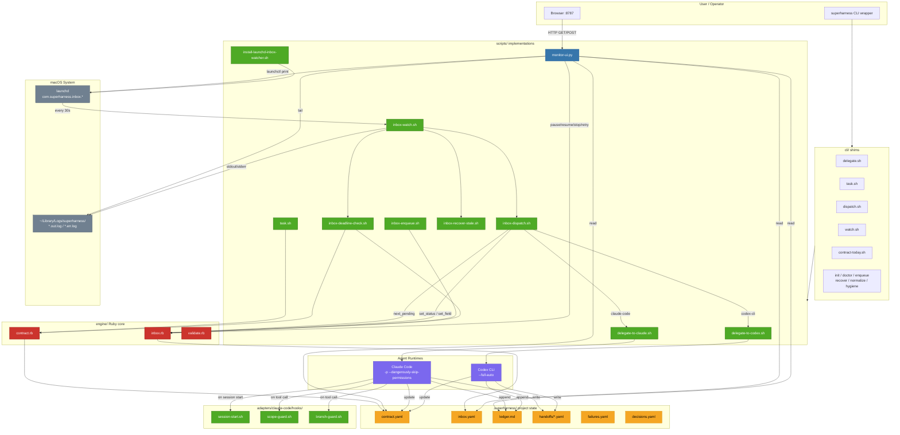

# superharness Architecture Diagram



## Legend

| Color | Language/Type | Count |
|-------|--------------|-------|
| Green | Shell scripts | 39 files |
| Red | Ruby engine | 3 files |
| Blue | Python | 1 file (monitor-ui) |
| Orange | State files | YAML/MD (contract, inbox, ledger, handoffs) |
| Purple | Agent runtimes | Claude Code, Codex CLI |
| Gray | System | launchd, log files |

## Key Flows

### 1. Dispatch Pipeline
```
launchd (every 30s)
  -> inbox-watch.sh
    -> inbox-deadline-check.sh (fail expired tasks)
    -> inbox-recover-stale.sh (retry stale items)
    -> inbox-dispatch.sh
      -> inbox.rb next_pending (pick highest priority)
      -> delegate-to-claude.sh | delegate-to-codex.sh
        -> Claude Code | Codex CLI (agent runs task)
      -> inbox.rb set_status (launched -> done/failed)
```

### 2. Monitor UI
```
Browser :8787
  -> GET /api/status (watcher state, inbox counts, log tails)
  -> GET /api/inbox?status=X (filtered items with detail)
  -> POST /api/action (pause/resume/stop/retry/dispatch)
    -> inbox.rb set_status | set_field | os.kill(PID)
```

### 3. Agent Hooks (Claude Code)
```
Claude session start
  -> session-start.sh (load contract context)
Claude tool call
  -> scope-guard.sh (enforce contract scope)
  -> branch-guard.sh (enforce branch policy)
```

### 4. Task Lifecycle
```
todo -> in_progress -> done       (happy path)
todo -> in_progress -> failed     (agent failure, requires --reason)
todo -> in_progress -> stopped    (manual stop, requires --reason)
pending -> paused -> pending      (monitor-ui pause/resume)
launched -> stopped               (monitor-ui stop via SIGTERM)
stale/failed/stopped -> pending   (monitor-ui retry)
```
