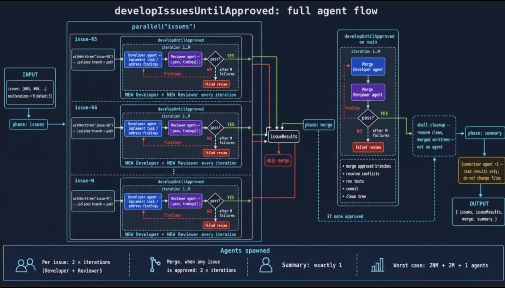
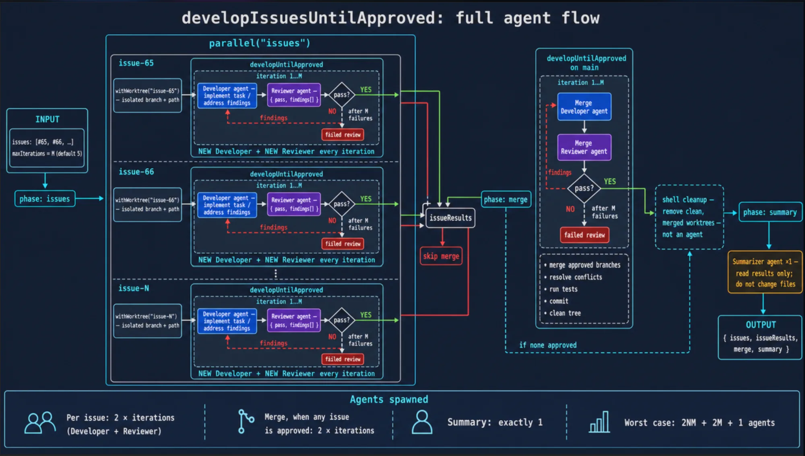

# FLOW — Pi `developIssuesUntilApproved` Multi-Agent Workflow

Source: r/PiCodingAgent — "pi-extensible-workflows: deterministic multi-agent" (diagram analysis, 2026-07-31).

Diagrams:

A deterministic script orchestrates disposable subagents: code controls the loop, agents do the work.

## 1. Input

- `issues: [#65, #66, ...]` — list of GitHub issues
- `maxIterations = M` (default 5) — retry budget per issue

## 2. Phase "issues" — parallel fan-out

Each issue gets its own lane; all lanes run concurrently:

- `withWorktree("issue-N")` creates an isolated git worktree (own branch, own path). Lanes never touch each other's files, so there are no merge conflicts mid-work.
- Inside each lane, a `developUntilApproved` loop runs iteration 1..M:
  1. **Developer agent** implements the task (or addresses previous findings)
  2. **Reviewer agent** inspects and returns `{ pass, findings[] }`
  3. `pass = YES` — lane done, result marked approved
  4. `pass = NO` — findings feed back; the loop repeats with a **fresh Developer + fresh Reviewer** each iteration. Key design: no context pollution — each iteration starts clean, only findings carry over
  5. After M consecutive failures the lane gives up and is marked "failed review"

## 3. `issueResults` collection (barrier)

All lane outcomes are collected. If zero issues were approved: **skip merge** entirely and jump to summary (the dashed "if none approved" line in the diagram).

## 4. Phase "merge" — `developUntilApproved` on main

Same loop pattern, reused on the main branch:

- **Merge Developer agent**: merge approved branches, resolve conflicts, run tests, commit, clean tree
- **Merge Reviewer agent**: verify the merge, return pass/findings
- Fail loop up to M times, same fresh-agent-per-iteration rule
- The merge is agent work, not a blind `git merge` — conflicts are resolved with intelligence

## 5. Shell cleanup (not an agent)

A plain script removes clean, merged worktrees. Deterministic code handles mechanical work — no agent is spawned where no judgment is needed.

## 6. Phase "summary"

One **Summarizer agent**, read-only, forbidden to change files. Writes the final report.

## 7. Output

`{ issues, issueResults, merge, summary }` — structured object returned to the caller.

## Agent cost math

- Per issue: 2 agents per iteration (Developer + Reviewer), so 2M worst case per issue
- N issues: 2NM
- Merge phase: 2M more
- Summary: 1
- **Worst case: 2NM + 2M + 1 agents.** Example: N=3 issues, M=5 gives 30 + 10 + 1 = 41 agents.

## Why the design is good

- Deterministic control flow (the script decides loops, retries, phases) around stochastic work units (agents). Reproducible orchestration, bounded cost.
- Worktree isolation makes parallelism safe.
- Fresh agents per iteration kill context rot; findings are the only memory carried forward.
- Reviewer gate before merge means no unreviewed code lands on main.
- Bounded retries (M) prevent infinite-loop token burn.
