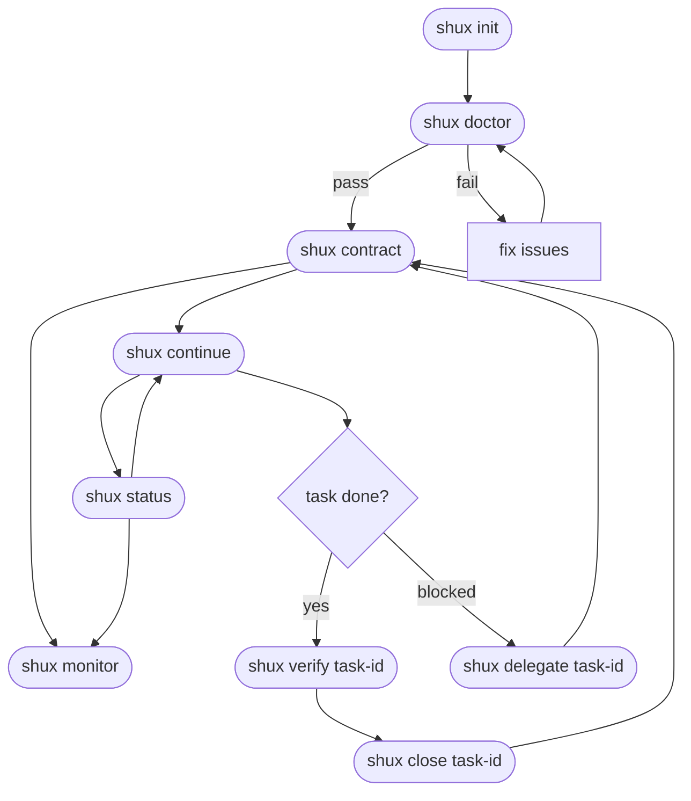
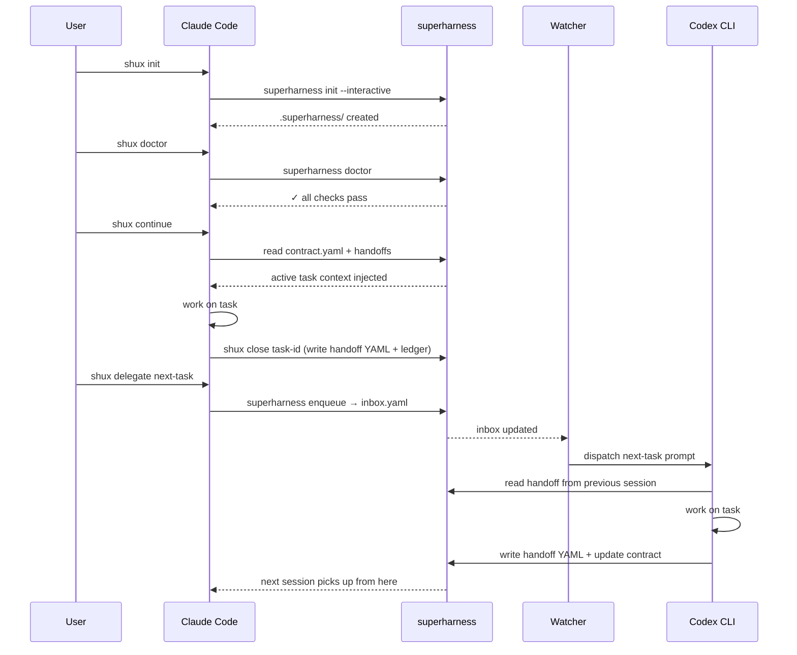

# superharness Command Reference

---

## Agent Shortcuts (`shux`) — Primary Interface

Type these directly into Claude Code or Codex CLI — no terminal needed after first install.

| Phrase | What happens |
|--------|-------------|
| `shux init` | Bootstrap `.superharness/` for this project (interactive) |
| `shux doctor` | Check prerequisites and protocol health |
| `shux contract` | Show all tasks with status, owner, and next-task suggestion |
| `shux continue` | Resume active contract and run full session lifecycle |
| `shux delegate <task-id>` | Create task + enqueue in one step for watcher dispatch |
| `shux test-type <task-id>` | Set mandatory test types for a task (interactive prompt) |
| `shux verify <task-id>` | Record verification result (pass/fail) before close |
| `shux close <task-id>` | Mark task done (requires verify), append ledger, write handoff |
| `shux status` | Dashboard: contract, tasks, watcher state, profile |
| `shux recall <keywords>` | Search past handoffs and ledger entries |
| `shux uninstall` | Remove watcher and system artifacts for this project |
| `shux hygiene` | Validate protocol compliance (contract, handoffs, ledger) |
| `shux monitor` | Open browser dashboard |
| `shux watch` | Start continuous watcher in foreground |
| `shux update` | Pull latest superharness (`git pull` in repo) + re-run init to refresh `CLAUDE.md`, `AGENTS.md`, templates |

**Full session flow:** `shux init` → `shux doctor` → `shux contract` → `shux continue` → `shux verify <id>` → `shux close <id>`

Old long-form phrases (`contract today`, `continue contract`, etc.) still work.

---

## Workflow Diagrams

### Onboarding & Command Flow



### Multi-Agent Handoff Loop



---

## Terminal Reference — Alternative Interface

For scripting, CI, or users who prefer direct shell access.

### Install

```bash
pipx install superharness
```

After install, `superharness` (and the `shux` alias) are available from anywhere. This is done once per machine. Upgrade anytime with `pipx upgrade superharness`.

### Init

Bootstrap protocol files in a project directory:

```bash
# Interactive (recommended):
superharness init --interactive

# Explicit:
superharness init "My Project" "Python/Docker" "active"

# Auto-detect stack and status from project files:
superharness init --detect

# From an agent-written profile.yaml:
superharness init --from-profile .superharness/profile.yaml
```

All modes create `.superharness/`, `CLAUDE.md`, and `AGENTS.md`. See [docs/INSTALL-AGENT.md](INSTALL-AGENT.md) for the agent-driven install flow.

### Delegation

Launch a session for the next pending task:

```bash
superharness delegate --to codex-cli --project /path/to/project
superharness delegate --to claude-code --project /path/to/project
```

**Options:**
- `--task <TASK_ID>` — force a specific task (bypasses next-task logic)
- `--print-only` — generate prompt text without launching the CLI
- `--model <tier|name>` — override model (mini/standard/max or sonnet/opus/haiku/gpt-5.3-codex)
- `--effort <low|medium|high>` — override thinking effort
- `--no-auto-model` — skip Haiku auto-classification, use profile defaults

**Shorthand by task id (auto-routes to task owner):**
```bash
superharness delegate mcp-docs --project /path/to/project --print-only
```

**Scheduling gates:** Delegate enforces three gates before dispatching:
- `scheduled_after` — blocks delegation if the date is in the future
- `due_by` — warns (doesn't block) if the task is overdue
- `depends_on` — blocks if dependency tasks are not done

**User instructions:** If `.superharness/handoffs/{task_id}-instructions.md` exists, its contents are injected into the agent prompt. The monitor UI Enqueue modal creates this file automatically.

### Contract snapshot

```bash
superharness contract today --project /path/to/project
```

Prints all tasks with id, status, owner, and suggests the next task to work on.

### Task lifecycle

Every task follows this mandatory sequence:

```
todo → plan_proposed → plan_approved → in_progress → report_ready → done
                                                          │
                                                   (optional Opus review)
                                               review_requested
                                                      │
                                           review_failed → plan_proposed  (loop)
                                           review_passed → done
```

| Phase | Who sets it | What happens |
|-------|-------------|--------------|
| `todo` | operator | task created; Enqueue button visible in monitor |
| `plan_proposed` | agent | agent writes plan handoff, stops and waits |
| `plan_approved` | operator | operator approves via `shux task status` (plans are typically reviewed upfront in the Enqueue modal before dispatch) |
| `in_progress` | agent | agent begins implementation |
| `report_ready` | agent | agent writes report handoff, stops and waits |
| `review_requested` | operator | operator requests Opus quality review |
| `review_passed` | Opus | review approved → ready to close |
| `review_failed` | Opus | review failed → agent loops back to `plan_proposed` |
| `done` | operator | operator runs `shux close <id>` |

The monitor UI (`shux monitor`) shows each task's current phase and presents the appropriate action button automatically.

### Task management

```bash
# Guided interactive wizard
superharness task

# Create task
superharness task create --project . --id task-id --title "Task title" --owner codex-cli

# Create task with dependency
superharness task create --project . --id test-task --title "Run tests" --owner codex-cli --dependency task-id

# Update task status
superharness task status --project . --id task-id --status in_progress --actor codex-cli

# Delete task
superharness task delete --project . --id task-id
```

### Inbox queue

**Enqueue a task:**
```bash
superharness enqueue --project . --to codex-cli --task task-id --priority 1
```

**Dispatch next pending item:**
```bash
superharness dispatch --project . --to codex-cli
```

Use `--print-only` to preview without launching.

**Start watcher (foreground):**
```bash
superharness watch --project . --to both
```

**Inbox status flow:**
1. `pending` → `launched` (dispatch claims item; retry count increments)
2. `launched` → `running` (agent begins work)
3. `running` → `done` or `failed` (agent completes or errors)
4. `pending` → `paused` (skipped this cycle — dirty worktree or plan gate pending)

### Inbox maintenance

**Recover stale launched items:**
```bash
superharness recover --project . --timeout-minutes 20 --action stale
```

**Normalize inbox (archive done/failed):**
```bash
superharness normalize --project . --archive
```

Archives `done` and `failed` items to `.superharness/inbox-archive.yaml`.

### Project Auto-Detection

Most commands require `--project DIR`. To avoid repeating it:

1. **Auto-detect from cwd:** If `.superharness/` exists in the current directory, `--project .` is injected automatically.
2. **Environment variable:** Set `SUPERHARNESS_PROJECT=/path/to/project` to use a fixed project directory.
3. **Explicit flag:** `--project DIR` always takes precedence.

### Protocol Hygiene

```bash
superharness hygiene --project .
superharness hygiene --project . --strict   # requires promotion alignment
```

**What hygiene checks validate:**
- Contract YAML structure and required fields
- Task status transitions (no invalid states)
- Handoff files match done tasks
- Ledger entries exist for completed work
- Decisions/failures promotion alignment (strict mode only)

**Failure-memory promotion workflow:**
1. Record task-local incidents in `.superharness/contract.yaml` under `failures`.
2. Promote reusable incidents to `.superharness/failures.yaml`.
3. Keep strict hygiene green by ensuring promoted failures are not left only in the contract.

### Doctor Checks

```bash
superharness doctor --project .
```

Checks for: required executables (`bash`, `python3`, `claude`, `codex`), protocol directory structure, YAML syntax validity, file permissions.

### Monitor UI

```bash
superharness monitor-ui --project .
superharness monitor-ui --project . --autohealth   # watchdog mode: auto-restarts if server dies
```

Includes: watcher state, inbox counters, one-click queue actions, Enqueue modal with TDD instructions, Done button for inbox-completed tasks, optional Logdy log view.

**Task action buttons:**
- **Enqueue** (todo/failed/stopped) — opens modal with personalized TDD plan from `docs/plan*.md`, acceptance criteria from contract, and prior failure context. User reviews/edits instructions before dispatch.
- **Enqueued** (disabled) — task already has an active inbox item
- **Done** — inbox item completed; marks contract task as done
- **Re-enqueue** (review_failed) — re-dispatch with corrective instructions

**API endpoints:**
- `GET /api/task-instructions?task=<id>` — personalized TDD instructions assembled from contract + plan docs
- `GET /api/task-report?task=<id>&agent=<name>` — task report with handoff data (reads both `.yaml` and `.md` handoffs with YAML frontmatter)

**Security:** binds to loopback only (127.0.0.1), mutating actions require per-session token printed to terminal on startup.

### Background Watcher

**macOS (launchd):**
```bash
bash scripts/install-launchd-inbox-watcher.sh \
  --project /path/to/project \
  --interval 30 \
  --confirm-non-interactive yes \
  --confirm-skip-permissions yes
```

**Linux (systemd):**
```bash
CONFIRM_NON_INTERACTIVE=yes bash scripts/install-systemd-inbox-watcher.sh \
  --project /path/to/project \
  --interval 30
```

**Uninstall watcher:**
```bash
superharness uninstall --project /path/to/project
```

**Notes:**
- Avoid `~/Documents`, `~/Desktop`, `~/Downloads` for watcher-managed projects on macOS — launchd can fail with `Operation not permitted`.
- Watcher logs: `~/Library/Logs/superharness/com.superharness.inbox.<project-name>-.out.log`
- **Auto-lifecycle (macOS):** The watcher is automatically unloaded when a Claude Code session ends (`session-stop` hook) and reloaded when a new session starts (`session-start` hook). You do not need to manually start/stop it between sessions. If the watcher appears absent mid-session, run `shux status` to check and `shux watch` to restart if needed.

**Required env vars for unattended dispatch:**
- `SUPERHARNESS_CONFIRM_NON_INTERACTIVE=YES`
- `SUPERHARNESS_CONFIRM_SKIP_PERMISSIONS=YES`

**Optional env vars:**
- `SUPERHARNESS_MONITOR_PORT` — override the monitor dashboard port (default: `8787`). Set this if port 8787 is in use. The session-stop hook uses this value when killing the monitor on session end.

### Readiness Audits

Use this for a generic cross-repo quality audit (in Claude Code):
```
/production-ready
```

Use this for superharness-specific release quality policy:
```
/superharness-production-ready
```

Rule of thumb:
- Use `/production-ready` for any repository.
- Use `/superharness-production-ready` for this repo to run local mandatory checks (contract protocol hygiene, regression guard, watcher/doctor posture).

**Run shell entrypoint guard:**
```bash
bash scripts/check-shell-entrypoints.sh
```

**Install git pre-commit hook:**
```bash
bash scripts/install-git-hooks.sh
```

---

## Troubleshooting

### Watcher not dispatching

```bash
tail -f ~/Library/Logs/superharness/com.superharness.inbox.<project-name>-.out.log
```

**Common causes:**
- `SUPERHARNESS_CONFIRM_NON_INTERACTIVE=YES` not set in plist
- Project path in restricted directory (`~/Documents`, `~/Desktop`, `~/Downloads`)
- `codex` or `claude` CLI not in PATH
- Stale lock: `rmdir .superharness/inbox.yaml.lock.d/` if no dispatch is running

### Inbox items stuck in `launched`

```bash
superharness recover --project . --timeout-minutes 20 --action stale
```

### Hygiene failures

```bash
superharness hygiene --project .
```

**Common fixes:**
- Missing handoff for done task → create handoff YAML in `.superharness/handoffs/`
- Missing ledger entry → append one line to `.superharness/ledger.md`
- Contract decisions not promoted → move reusable decisions to `.superharness/decisions.yaml`

### Claude or Codex CLI not found

```
claude: command not found
codex: command not found
```

Install:
- Claude CLI: `npm install -g @anthropic-ai/claude-code`
- Codex CLI: `npm install -g @openai/codex`

These are optional — only required if you use `delegate --to claude-code` or `delegate --to codex-cli`. `dispatch --print-only` works without them.

### launchd watcher not loading (macOS)

Check whether the plist loaded:
```bash
launchctl list | grep superharness
```

If missing, reload manually:
```bash
launchctl bootstrap gui/$(id -u) ~/Library/LaunchAgents/com.superharness.inbox.<project-name>-.plist
```

**Common causes:**
- Project path is in `~/Documents`, `~/Desktop`, or `~/Downloads` — macOS sandbox blocks launchd there. Move the project or use `superharness watch --foreground` instead.
- Missing `SUPERHARNESS_CONFIRM_NON_INTERACTIVE=YES` in the plist `EnvironmentVariables` block — re-run install with `--confirm-non-interactive yes`.
- Plist has wrong path after repo move — re-run `scripts/install-launchd-inbox-watcher.sh`.

View launchd error logs:
```bash
log show --predicate 'process == "launchd"' --last 5m | grep superharness
```

---

## Teams

### Commit `.superharness/` or ignore it?

| Scenario | Recommendation |
|----------|----------------|
| Solo / personal | `echo '.superharness/' >> .gitignore` |
| Team / shared agents | `git add .superharness/` — everyone reads the same contract |
| Agents opening PRs | Commit — agents read `contract.yaml` before each session |

### Task ownership

Tasks have an `owner` field (`claude-code` or `codex-cli`). Assign by agent type, not person — any team member can launch the owning agent.

### Concurrency

superharness uses file-based locking (`inbox.yaml.lock.d/`) — two watchers on the same directory won't double-dispatch. Avoid running watchers from different machines on the same directory (locking is local).

### CI (Linux, foreground mode)

```bash
SUPERHARNESS_CONFIRM_NON_INTERACTIVE=YES \
superharness watch --foreground --project . --interval 60 --launcher-timeout 300
```

### Onboarding a new team member

```bash
# Terminal: install CLI (one-time)
pipx install superharness   # or: pipx upgrade superharness

# Then in Claude Code or Codex CLI:
# shux doctor      ← verify setup
# shux contract    ← pick up where the last session left off
```

---

## See Also

- **Architecture:** [ARCHITECTURE.md](ARCHITECTURE.md) — how superharness works internally
- **Security:** [SECURITY.md](../SECURITY.md) — threat model and mitigations
- **Changelog:** [CHANGELOG.md](../CHANGELOG.md) — version history
