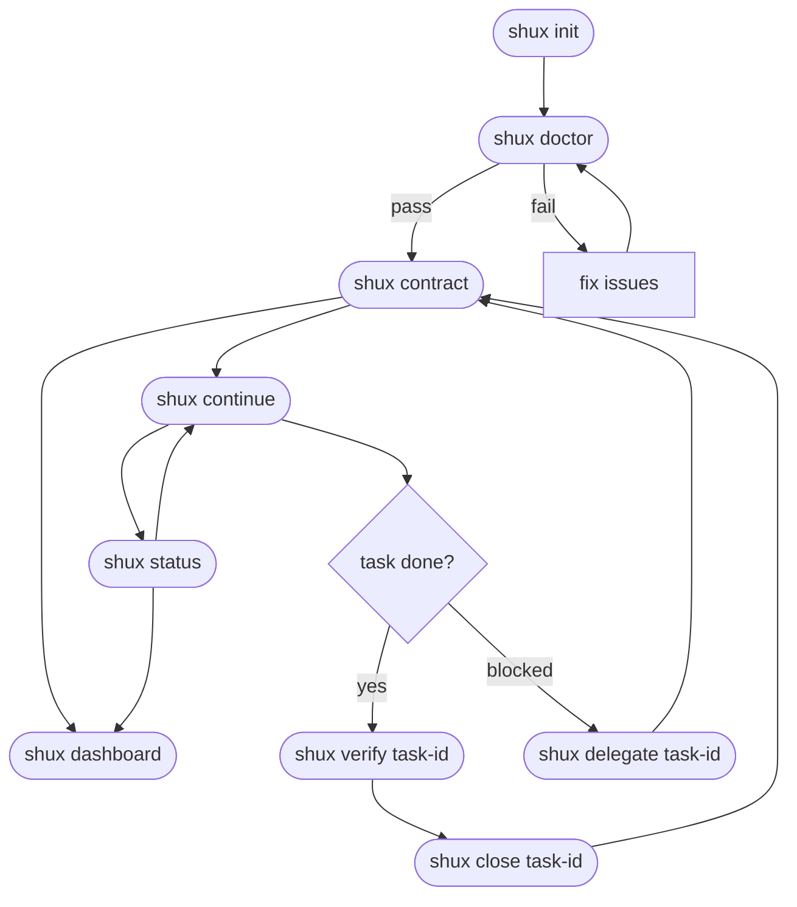
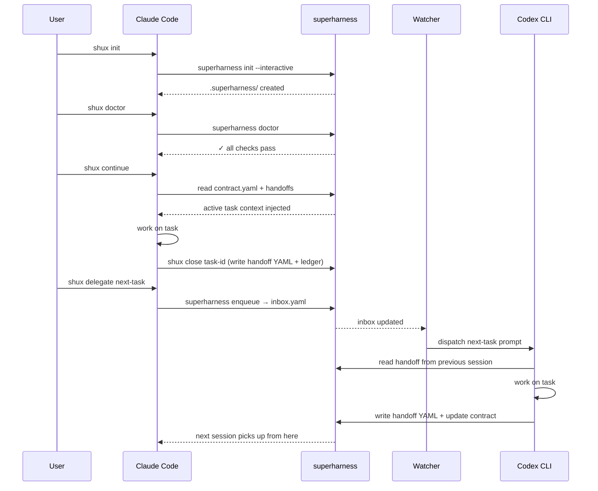

# superharness Command Reference

---

## Agent Shortcuts (`shux`) — Primary Interface

Type these directly into Claude Code or Codex CLI — no terminal needed after first install.

| Phrase | What happens |
|--------|-------------|
| `shux onboard` | First-time setup wizard — detect stack, scaffold `.superharness/`, write `AGENTS.md`, configure git tracking, create first task |
| `shux init` | Bootstrap `.superharness/` for this project (interactive) |
| `shux doctor` | Check prerequisites and protocol health |
| `shux contract` | Show all tasks with status, owner, and next-task suggestion |
| `shux continue` | Resume active contract and run full session lifecycle |
| `shux delegate <task-id>` | Create task + enqueue in one step for watcher dispatch. Add `--force` to bypass budget block. |
| `shux test-type <task-id>` | Set mandatory test types for a task (interactive prompt) |
| `shux verify <task-id>` | Record verification result (pass/fail) before close |
| `shux close <task-id>` | Mark task done (requires verify), append ledger, write handoff |
| `shux status` | Dashboard: contract, tasks, watcher state, profile |
| `shux recall <keywords>` | Search past handoffs and ledger entries |
| `shux demo` | Zero-config task lifecycle walkthrough in a temp directory — explains what superharness is and shows all 5 core commands before running |
| `shux uninstall` | Remove watcher and system artifacts for this project |
| `shux hygiene` | Validate protocol compliance (contract, handoffs, ledger) |
| `shux dashboard` | Open browser dashboard |
| `shux watch` | Start continuous watcher in foreground |
| `shux update` | Pull latest superharness (`git pull` in repo) + re-run init to refresh `CLAUDE.md`, `AGENTS.md`, templates |
| `shux config get <key>` | Read a dot-path key from `profile.yaml` (e.g. `budget.daily_limit`) |
| `shux config set <key> <value>` | Write a dot-path key to `profile.yaml` |
| `shux inbox-gc` | Reconcile stale inbox items (stopped/failed/paused) against contract |
| `shux worktree-gc` | Clean orphaned dispatch worktrees from `/tmp` |
| `shux recap` | What happened in the last N hours — timeline of ledger, inbox, handoffs |
| `shux notify-desktop` | Send a native macOS/Linux desktop notification |

**Full session flow:** `shux onboard` (new project) → `shux doctor` → `shux contract` → `shux continue` → `shux verify <id>` → `shux close <id>`

**New project cold-start:** Running `shux --help` in a directory without `.superharness/` shows a quickstart banner pointing to `shux onboard`.

Old long-form phrases (`contract today`, `continue contract`, etc.) still work.

---

## Workflow Diagrams

### Onboarding & Command Flow



### Multi-Agent Handoff Loop



---

## Onboarding a New Project (`shux onboard`)

`shux onboard` is the recommended first command for any project that doesn't yet have superharness set up. It opens with a brief explanation of what superharness is and the 5 core commands, then runs a 7-step wizard that detects your stack, scaffolds the protocol directory, and gets Claude/Codex agents oriented immediately.

```bash
shux onboard                        # interactive wizard in current directory
shux onboard --non-interactive      # fully unattended (CI, scripts)
shux onboard --git-mode solo        # keep .superharness/ local (gitignored)
shux onboard --git-mode team        # commit .superharness/ for shared access (default)
shux onboard --task-title "Fix auth bug"           # create first task during setup
shux onboard --task-title "Fix auth bug" --enqueue  # create + enqueue immediately
shux onboard --project /path/to/project            # target a different directory
```

**Steps (in order):**

| Step | Name | What it does |
|------|------|-------------|
| 1 | `detect` | Heuristic stack detection (Python, Node.js, Rust, Go, Ruby, unknown) |
| 2 | `init` | Creates `.superharness/` scaffold (`contract.yaml`, `ledger.md`); writes `AGENTS.md` if missing |
| 2b | `global_claude` | Appends a superharness section to `~/.claude/CLAUDE.md` (once per machine, skip if already present) |
| 3 | `git_track` | Configures `.gitignore` for solo or team mode; writes `.superharness/.gitignore` for runtime files |
| 4 | `doctor` | Runs `shux doctor` non-blocking — warnings shown but don't stop setup |
| 5 | `task` | Creates a first task in `contract.yaml` if `--task-title` given |
| 6 | `delegate` | Enqueues the task to `inbox.yaml` if `--enqueue` given |
| 7 | `summary` | Prints next steps |

**Resumability:** Each step records its result in `.superharness/onboarding.yaml`. Re-running `shux onboard` skips completed steps — safe to run multiple times.

**What gets written:**

- `.superharness/contract.yaml` — empty task list (append tasks later with `shux delegate`)
- `.superharness/ledger.md` — session history file
- `AGENTS.md` — instructions for Claude Code and Codex CLI to use `shux` commands. Never overwritten if it already exists.
- `~/.claude/CLAUDE.md` — a `## superharness` section is appended (once) so every Claude Code session on this machine knows to use `shux`. Never written if the file is missing; never duplicated if already present.
- Root `.gitignore` — `.superharness/` entry added (solo mode only)
- `.superharness/.gitignore` — excludes runtime files: `watcher-env.yaml`, `launcher-logs/`, `daemon.pid.json`, `onboarding.yaml`

## Exploring superharness (`shux demo`)

`shux demo` runs a zero-config task lifecycle walkthrough in a temporary directory. It requires no arguments and leaves your project untouched.

**What it does:**

1. Prints a "what is superharness" intro — the problem it solves, the 3 key files, the task flow, and the 5 core commands.
2. Scaffolds a temp project and walks through: `init` → `task create` → `enqueue` → `dispatch (print-only)` → `hygiene check`.
3. Prints next steps for trying it on a real project.

```bash
shux demo           # walkthrough in a temp dir (deleted after)
shux demo --keep    # keep the temp dir to inspect the files
```

Use `shux demo` to orient a new team member or verify that your superharness install is working end-to-end.

**Adapter hooks bundled in the package:** Since v1.11.0, the Claude Code adapter hooks (`adapters/claude-code/hooks/`) are bundled inside the installed package. `shux install-hooks` and `shux onboard` now work correctly after a `pip install superharness` or `pipx install superharness` without requiring a repo checkout.

---

## Terminal Reference — Alternative Interface

For scripting, CI, or users who prefer direct shell access.

### Install

```bash
pipx install superharness
```

After install, `superharness` (and the `shux` alias) are available from anywhere. This is done once per machine. Upgrade anytime with `pipx upgrade superharness`.

### Init

Bootstrap protocol files in a project directory:

```bash
# Interactive (recommended):
superharness init --interactive

# Explicit:
superharness init "My Project" "Python/Docker" "active"

# Auto-detect stack and status from project files:
superharness init --detect

# From an agent-written profile.yaml:
superharness init --from-profile .superharness/profile.yaml
```

All modes create `.superharness/`, `CLAUDE.md`, and `AGENTS.md`. See [docs/INSTALL-AGENT.md](INSTALL-AGENT.md) for the agent-driven install flow.

### Delegation

Launch a session for the next pending task:

```bash
superharness delegate --to codex-cli --project /path/to/project
superharness delegate --to claude-code --project /path/to/project
```

**Options:**
- `--task <TASK_ID>` — force a specific task (bypasses next-task logic)
- `--print-only` — generate prompt text without launching the CLI
- `--model <tier|name>` — override model (mini/standard/max or sonnet/opus/haiku/gpt-5.3-codex)
- `--effort <low|medium|high>` — override thinking effort
- `--no-auto-model` — skip Haiku auto-classification, use profile defaults
- `--orchestrate` — Opus orchestrator mode: decompose the task into subtasks, assign each a model tier (mini/standard/max), estimate cost, write subtasks to `contract.yaml`, then dispatch
- `--force` — bypass a daily budget BLOCK and dispatch anyway (use sparingly)

**Budget guard:** Before dispatching, `delegate` checks today's total spend (summed from `benchmark.jsonl`) against `budget.daily_limit` in `profile.yaml`:
- **WARN** (≥ 80% of limit) — prints a warning, dispatch continues
- **BLOCK** (≥ 100% of limit) — prints an error and returns exit 1; use `--force` to override

Configure the limit:
```bash
shux config set budget.daily_limit 5.00    # block at $5/day
shux config set budget.weekly_limit 20.00  # informational weekly cap shown in benchmark
```

**Orchestrator mode** — Opus decomposes the task before dispatching:
```bash
superharness delegate --to claude-code --task T-42 --orchestrate
# Opus analyzes T-42, breaks it into subtasks (e.g. T-42.1 standard, T-42.2 mini),
# estimates cost, writes subtasks to contract.yaml, then dispatches each sub-agent
# at the appropriate tier (Haiku/Sonnet/Opus).
```

**Shorthand by task id (auto-routes to task owner):**
```bash
superharness delegate mcp-docs --project /path/to/project --print-only
```

**Scheduling gates:** Delegate enforces three gates before dispatching:
- `scheduled_after` — blocks delegation if the date is in the future
- `due_by` — warns (doesn't block) if the task is overdue
- `depends_on` — blocks if dependency tasks are not done

**User instructions:** If `.superharness/handoffs/{task_id}-instructions.md` exists, its contents are injected into the agent prompt. The dashboard Enqueue modal creates this file automatically.

### Contract snapshot

```bash
superharness contract today --project /path/to/project
```

Prints all tasks with id, status, owner, and suggests the next task to work on.

### Task lifecycle

Every task follows this mandatory sequence:

```
todo → plan_proposed → plan_approved → in_progress → report_ready → done
                                                          │
                                                   (optional Opus review)
                                               review_requested
                                                      │
                                           review_failed → plan_proposed  (loop)
                                           review_passed → done
```

| Phase | Who sets it | What happens |
|-------|-------------|--------------|
| `todo` | operator | task created; Enqueue button visible in dashboard |
| `plan_proposed` | agent | agent writes plan handoff, stops and waits |
| `plan_approved` | operator | operator approves via `shux task status` (plans are typically reviewed upfront in the Enqueue modal before dispatch) |
| `in_progress` | agent | agent begins implementation |
| `report_ready` | agent | agent writes report handoff, stops and waits |
| `review_requested` | operator | operator requests Opus quality review |
| `review_passed` | Opus | review approved → ready to close |
| `review_failed` | Opus | review failed → agent loops back to `plan_proposed` |
| `done` | operator | operator runs `shux close <id>` |

The dashboard (`shux dashboard`) shows each task's current phase and presents the appropriate action button automatically.

### Task management

```bash
# Guided interactive wizard
superharness task

# Create task (--id is optional; auto-generated as t-XXXXXX when omitted)
superharness task create --project . --title "Task title" --owner codex-cli

# Create task with explicit ID
superharness task create --project . --id task-id --title "Task title" --owner codex-cli

# Create task with dependency
superharness task create --project . --id test-task --title "Run tests" --owner codex-cli --dependency task-id

# Create task with effort, test types, and context
superharness task create --project . --id feat.search \
  --title "Add search endpoint" --owner claude-code \
  --effort high --test-types unit,integration \
  --context "Read src/api/ first" \
  --timeout-minutes 20

# Create task with out-of-scope and definition-of-done
superharness task create --project . --id feat.auth \
  --title "Add OAuth2 auth" --owner claude-code \
  --effort max \
  --out-of-scope "no UI login page" \
  --out-of-scope "do not modify user model" \
  --definition-of-done "all tests pass" \
  --definition-of-done "no new shipguard warnings"

# Create task with BDD plan phases
superharness task create --project . --id feat.checkout \
  --title "Checkout flow" --owner claude-code \
  --development-method bdd \
  --bdd-given "user has items in cart" \
  --bdd-when "user clicks checkout" \
  --bdd-then "order created and email sent"

# Update task status
superharness task status --project . --id task-id --status in_progress --actor codex-cli

# Delete task
superharness task delete --project . --id task-id
```

**`task create` flags:**

| Flag | Type | Default | Description |
|------|------|---------|-------------|
| `--effort` | `low\|medium\|high\|max` | `medium` | Effort level — affects orchestrator split decisions and timeout defaults |
| `--test-types` | comma-separated | none | Test types required (e.g. `unit,integration,e2e,security`) |
| `--out-of-scope` | repeatable | none | Scope boundaries — orchestrator respects these |
| `--definition-of-done` | repeatable | none | Explicit DoD (overrides contract-level `default_definition_of_done`) |
| `--context` | string | none | Operator-authored context injected into dispatch prompt |
| `--timeout-minutes` | int | auto | Task timeout (auto-derived from model + effort if not set) |
| `--bdd-given` | string | none | BDD given phase |
| `--bdd-when` | string | none | BDD when phase |
| `--bdd-then` | string | none | BDD then phase |
| `--development-method` | any string | none | Development method (accepts any value, not just tdd/bdd/sdd) |

### Inbox queue

**Enqueue a task:**
```bash
superharness enqueue --project . --to codex-cli --task task-id --priority 1
```

**Dispatch next pending item:**
```bash
superharness dispatch --project . --to codex-cli
```

Use `--print-only` to preview without launching.

**Start watcher (foreground):**
```bash
superharness watch --project . --to both
```

**Inbox status flow:**
1. `pending` → `launched` (dispatch claims item; retry count increments)
2. `launched` → `running` (agent begins work)
3. `running` → `done` or `failed` (agent completes or errors)
4. `pending` → `paused` (skipped this cycle — dirty worktree or plan gate pending)

### Inbox maintenance

**Recover stale launched items:**
```bash
superharness recover --project . --timeout-minutes 20 --action stale
```

**Reconcile stale inbox items (garbage collector):**
```bash
superharness inbox-gc --project .            # reconcile and fix
superharness inbox-gc --project . --dry-run  # preview without changes
```

Finds inbox items in `stopped`, `failed`, `paused`, or `stale` status where the
corresponding contract task is already `done`, and marks them as `done`. Writes a
ledger entry for each reconciled item.

**Normalize inbox (archive done/failed):**
```bash
superharness normalize --project . --archive
```

Archives `done` and `failed` items to `.superharness/inbox-archive.yaml`.

**Clean orphaned dispatch worktrees:**
```bash
superharness worktree-gc --project .            # remove orphaned worktrees
superharness worktree-gc --project . --dry-run  # preview without removing
```

Removes temporary worktrees left behind by dispatch (created in `/tmp/superharness-worktrees/`).

**Session recap — what happened recently:**
```bash
superharness recap --project .              # last 4 hours (default)
superharness recap --project . --hours 8    # last 8 hours
```

Summarizes ledger entries, inbox events, handoffs, and task changes in a timeline view.

**Desktop notifications:**
```bash
superharness notify-desktop --message "Task done"
```

Sends a native macOS/Linux notification. Also fires automatically when a dispatched task completes or fails.

### Project Auto-Detection

Most commands require `--project DIR`. To avoid repeating it:

1. **Auto-detect from cwd:** If `.superharness/` exists in the current directory, `--project .` is injected automatically.
2. **Environment variable:** Set `SUPERHARNESS_PROJECT=/path/to/project` to use a fixed project directory.
3. **Explicit flag:** `--project DIR` always takes precedence.

### Protocol Hygiene

```bash
superharness hygiene --project .
superharness hygiene --project . --strict   # requires promotion alignment
```

**What hygiene checks validate:**
- Contract YAML structure and required fields
- Task status transitions (no invalid states)
- Handoff files match done tasks
- Ledger entries exist for completed work
- Decisions/failures promotion alignment (strict mode only)

**Failure-memory promotion workflow:**
1. Record task-local incidents in `.superharness/contract.yaml` under `failures`.
2. Promote reusable incidents to `.superharness/failures.yaml`.
3. Keep strict hygiene green by ensuring promoted failures are not left only in the contract.

### Configuration (`shux config`)

Read and write dot-path keys in `.superharness/profile.yaml`:

```bash
# Read a value
shux config get budget.daily_limit
shux config get budget.weekly_limit

# Write a value (auto-coerced to int/float/bool/str)
shux config set budget.daily_limit 5.00
shux config set budget.weekly_limit 20.00

# Target a different project
shux config get budget.daily_limit --project /path/to/project
shux config set budget.daily_limit 3.00 --project /path/to/project
```

**Budget keys in `profile.yaml`:**

```yaml
budget:
  daily_limit: 5.00    # BLOCK dispatch when today's spend reaches this (USD)
  weekly_limit: 20.00  # Informational cap shown in shux benchmark --models
```

Both keys are optional. If `daily_limit` is absent, the budget guard is disabled.

**Auto-dispatch key in `profile.yaml`:**

```yaml
auto_dispatch: true   # Automatically enqueue plan_approved tasks to inbox without manual shux delegate
```

When `auto_dispatch: true`, the watcher scans the contract on each tick and enqueues any task with
`status: plan_approved` (owned by the appropriate agent) that has no active inbox entry and whose
`blocked_by` dependencies are resolved. Set via:

```bash
shux config set auto_dispatch true
```

### Cost Tracking (`shux benchmark`)

```bash
shux benchmark --project .            # recent session cost summary
shux benchmark --project . --models   # per-model 7-day cost breakdown table
```

`--models` output shows: model name, call count, total tokens, total cost, % of weekly budget (if `budget.weekly_limit` is set in `profile.yaml`).

### Doctor Checks

```bash
superharness doctor --project .
```

Checks for: required executables (`bash`, `python3`, `claude`, `codex`), protocol directory structure, YAML syntax validity, file permissions.

### Dashboard UI

```bash
superharness dashboard-ui --project .
superharness dashboard-ui --project . --port 8788
superharness dashboard-ui --project . --autohealth   # watchdog mode: auto-restarts if server dies

# Process management
shux dashboard-list          # list all running dashboard-ui processes (PID, port, URL)
shux dashboard-kill          # kill all dashboard-ui processes
shux dashboard-kill --port 8787   # kill only the one on a specific port
```

Includes: watcher state, inbox counters, one-click queue actions, Enqueue modal with TDD instructions, Done button for inbox-completed tasks, optional Logdy log view.

Notes:
- Multiple dashboard processes can run at once for different projects.
- Without an explicit `--port`, the dashboard tries `8787` first and then the next free ports in the local scan range.
- Use `shux dashboard-list` to see which project is on which port.

**Dashboard panels:**
- **Git context** — current branch, dirty file count, and last commit in the header
- **Activity feed** — live timeline of dispatch, gc, inbox, and ledger events (last 4 hours)
- **Task dependency graph** — mermaid diagram of `blocked_by` relationships (press `g` to toggle)
- **Inbox reason column** — shows `pause_reason`, `failed_reason` etc. in human-readable text; click for full details panel
- **Dispatch preview** — enqueue modal shows model, effort, cost/MTok, and timeout before dispatch

**Keyboard shortcuts:**
| Key | Action |
|-----|--------|
| `r` | Refresh |
| `g` | Toggle dependency graph |
| `l` | List view |
| `b` | Board view |
| `?` | Show shortcut help |

**Task action buttons:**
- **not queued** (clickable) — opens enqueue modal with dispatch preview
- **queued** (green pill) — task has an active inbox item
- **Re-queue** (stopped) — re-enables task
- **Request Review** — choose reviewer (claude-code or codex-cli) via dropdown
- **Cancel Review** / **Approve Without Review** — for `review_requested` tasks
- **Done** — inbox item completed; marks contract task as done

**API endpoints:**
- `GET /api/task-instructions?task=<id>` — personalized TDD instructions assembled from contract + plan docs
- `GET /api/task-report?task=<id>&agent=<name>` — task report with handoff data (reads both `.yaml` and `.md` handoffs with YAML frontmatter)

**Security:** binds to loopback only (127.0.0.1), mutating actions require per-session token printed to terminal on startup.

### Background Watcher

**macOS (launchd):**
```bash
bash scripts/install-launchd-inbox-watcher.sh \
  --project /path/to/project \
  --interval 30 \
  --confirm-non-interactive yes \
  --confirm-skip-permissions yes
```

**Linux (systemd):**
```bash
CONFIRM_NON_INTERACTIVE=yes bash scripts/install-systemd-inbox-watcher.sh \
  --project /path/to/project \
  --interval 30
```

**Uninstall watcher:**
```bash
superharness uninstall --project /path/to/project
```

**Notes:**
- Avoid `~/Documents`, `~/Desktop`, `~/Downloads` for watcher-managed projects on macOS — launchd can fail with `Operation not permitted`.
- Watcher logs: `~/Library/Logs/superharness/com.superharness.inbox.<project-name>-.out.log`
- **Session lifecycle:** `session-stop` writes `session-progress.md`, marks active Claude-owned `in_progress` tasks as `stopped`, writes a stop handoff, and pauses remaining Claude-targeted active inbox items. It does not unload the watcher or kill running dashboards.

**Required env vars for unattended dispatch:**
- `SUPERHARNESS_CONFIRM_NON_INTERACTIVE=YES`
- `SUPERHARNESS_CONFIRM_SKIP_PERMISSIONS=YES`

### Readiness Audits

Use this for a generic cross-repo quality audit (in Claude Code):
```
/production-ready
```

Use this for superharness-specific release quality policy:
```
/superharness-production-ready
```

Rule of thumb:
- Use `/production-ready` for any repository.
- Use `/superharness-production-ready` for this repo to run local mandatory checks (contract protocol hygiene, regression guard, watcher/doctor posture).

**Run shell entrypoint guard:**
```bash
bash scripts/check-shell-entrypoints.sh
```

**Install git pre-commit hook:**
```bash
bash scripts/install-git-hooks.sh
```

---

## Troubleshooting

### Watcher not dispatching

```bash
tail -f ~/Library/Logs/superharness/com.superharness.inbox.<project-name>-.out.log
```

**Common causes:**
- `SUPERHARNESS_CONFIRM_NON_INTERACTIVE=YES` not set in plist
- Project path in restricted directory (`~/Documents`, `~/Desktop`, `~/Downloads`)
- `codex` or `claude` CLI not in PATH
- Stale lock: `rmdir .superharness/inbox.yaml.lock.d/` if no dispatch is running

### Inbox items stuck in `launched`

```bash
superharness recover --project . --timeout-minutes 20 --action stale
```

### Hygiene failures

```bash
superharness hygiene --project .
```

**Common fixes:**
- Missing handoff for done task → create handoff YAML in `.superharness/handoffs/`
- Missing ledger entry → append one line to `.superharness/ledger.md`
- Contract decisions not promoted → move reusable decisions to `.superharness/decisions.yaml`

### Claude or Codex CLI not found

```
claude: command not found
codex: command not found
```

Install:
- Claude CLI: `npm install -g @anthropic-ai/claude-code`
- Codex CLI: `npm install -g @openai/codex`

These are optional — only required if you use `delegate --to claude-code` or `delegate --to codex-cli`. `dispatch --print-only` works without them.

### launchd watcher not loading (macOS)

Check whether the plist loaded:
```bash
launchctl list | grep superharness
```

If missing, reload manually:
```bash
launchctl bootstrap gui/$(id -u) ~/Library/LaunchAgents/com.superharness.inbox.<project-name>-.plist
```

**Common causes:**
- Project path is in `~/Documents`, `~/Desktop`, or `~/Downloads` — macOS sandbox blocks launchd there. Move the project or use `superharness watch --foreground` instead.
- Missing `SUPERHARNESS_CONFIRM_NON_INTERACTIVE=YES` in the plist `EnvironmentVariables` block — re-run install with `--confirm-non-interactive yes`.
- Plist has wrong path after repo move — re-run `scripts/install-launchd-inbox-watcher.sh`.

View launchd error logs:
```bash
log show --predicate 'process == "launchd"' --last 5m | grep superharness
```

---

## Teams

### Commit `.superharness/` or ignore it?

| Scenario | Recommendation |
|----------|----------------|
| Solo / personal | `echo '.superharness/' >> .gitignore` |
| Team / shared agents | `git add .superharness/` — everyone reads the same contract |
| Agents opening PRs | Commit — agents read `contract.yaml` before each session |

### Task ownership

Tasks have an `owner` field (`claude-code` or `codex-cli`). Assign by agent type, not person — any team member can launch the owning agent.

### Concurrency

superharness uses file-based locking (`inbox.yaml.lock.d/`) — two watchers on the same directory won't double-dispatch. Avoid running watchers from different machines on the same directory (locking is local).

### CI (Linux, foreground mode)

```bash
SUPERHARNESS_CONFIRM_NON_INTERACTIVE=YES \
superharness watch --foreground --project . --interval 60 --launcher-timeout 300
```

### Onboarding a new team member

```bash
# 1. Install CLI (one-time per machine)
pipx install superharness   # or: pipx upgrade superharness

# 2. In the project directory, run the setup wizard
shux onboard                # sets up .superharness/, AGENTS.md, git tracking
# or: shux onboard --non-interactive --git-mode team

# 3. Then in Claude Code or Codex CLI:
# shux doctor      ← verify setup
# shux contract    ← pick up where the last session left off
```

The wizard also appends a `## superharness` section to `~/.claude/CLAUDE.md` (once per machine) so Claude Code knows to use `shux` commands in any project.

---

## See Also

- **Architecture:** [ARCHITECTURE.md](ARCHITECTURE.md) — how superharness works internally
- **Security:** [SECURITY.md](../SECURITY.md) — threat model and mitigations
- **Changelog:** [CHANGELOG.md](../CHANGELOG.md) — version history
